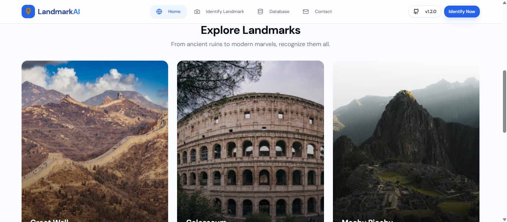
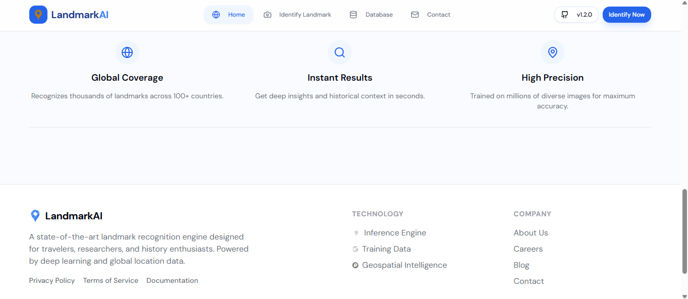

# 📍 DeepLandmark - Landmark Detection ML App

[](https://landmarkai.nexttoken.app/)

## 🌐 Live Demo
🔗 https://landmarkai.nexttoken.app  

👉 Upload an image and instantly detect landmarks using a trained machine learning model.

---

## 📷 Demo





---

## 📌 Overview
**DeepLandmark** is a machine learning-based application that detects and classifies landmarks from images.  
The model is trained on labeled image data and deployed as a **live web application**, enabling real-time predictions.

---

## 🚀 Features
- 📸 Upload image for instant prediction  
- 🧠 Machine Learning-based classification  
- ⚡ Real-time results with confidence score  
- 🌐 Deployed live web application  
- 🧩 Scalable architecture for adding more landmarks  

---

## 🛠️ Tech Stack
- **Programming:** Python  
- **Libraries:** NumPy, Pandas, Matplotlib  
- **ML Framework:** TensorFlow / Scikit-learn  
- **Image Processing:** OpenCV  
- **Deployment:** Streamlit  

---

## ⚙️ How It Works

1. **Data Collection**
   - Dataset sourced from Kaggle  
   - Images categorized into landmark classes  

2. **Data Preprocessing**
   - Image resizing and normalization  
   - Data cleaning and preparation  

3. **Model Training**
   - Trained ML model for image classification  
   - Achieved strong performance on test data  

4. **Prediction**
   - User uploads image  
   - Model predicts landmark with confidence score  

---

## 📊 Model Performance
- ✅ Accuracy: **~85–90%**  
- 📁 Dataset: Kaggle  
- 📈 Performance improves with more training data  

---

## 📂 Project Structure

landmark-detection/
│── dataset/
│── model/
│── notebooks/
│── main.py
│── requirements.txt
│── README.md


## ▶️ How to Run

1. Clone the repository:
```bash
git clone https://github.com/HarshGautam0/landmark-detection.git

cd landmark-detection

pip install -r requirements.txt

python main.py
```

🌍 Deployment

This project is deployed as a live web application:

🔗 https://landmarkai.nexttoken.app/


📌 Future Improvements

-- Use Deep Learning (CNN) for higher accuracy
-- Deploy as a web application
-- Integrate real-time detection using webcam

🙌 Acknowledgment

-- This project was developed as part of a Machine Learning internship to gain practical exposure to image classification problems.


📫 Contact

Harsh Gautam
📧 hg699810@gmail.com

🔗 https://github.com/HarshGautam0

